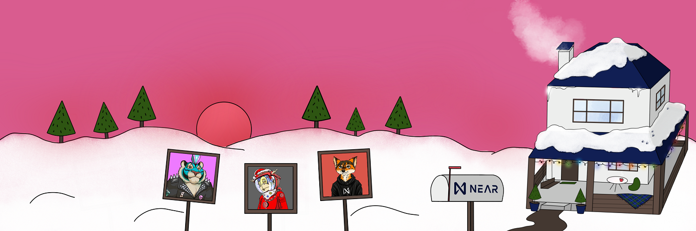

# Introduction

**NEARton** is a DeFi strategy game based on [NFT Staking](./nft_staking.md) and a beautiful gallery for your assets, powered by [NEAR Protocol](https://near.org/).

Sounds sweet, right? But what exactly does it mean? Let's figure it out together step-by-step.

* First of all, NEARton is NFT Collection itself. Each house is NFT with its own rarity attributes.

* We will have a map of the town, and a shareable gallery page for each house to show off your home and your other NFTs.

* __DeFi strategy game__ - __this doesn't mean that it's a "classic game"__ where you fight against mobs. We're going to gamify the NFT staking process with rarities, boosters, and the ability to stake NFTs from other well-known collections. So, the combination of all your NFTs will affect your [$NEXP](./the_NEXP_token.md) rewards rate.

* You can spend [$NEXP](./the_NEXP_token.md) inside (and we hope outside) the town on additional accessories for your houses, gambling, self-promotion on local radio, and other fun stuff.

* After NFTs distribution, we're going to create a DAO for all holders. DAO will decide which other collections to partner with for staking.

## Motivation
Our main goal is to connect strong NFT communities on [NEAR](https://near.org/) and provide additional utility for NFT collectibles by staking.

NEARton is the project for the ecosystem, and we believe it can attract more NFT collectors from other chains and make rarity sniping fun again.

And, of course, NEARton is a fun way to flex your NFTs.

