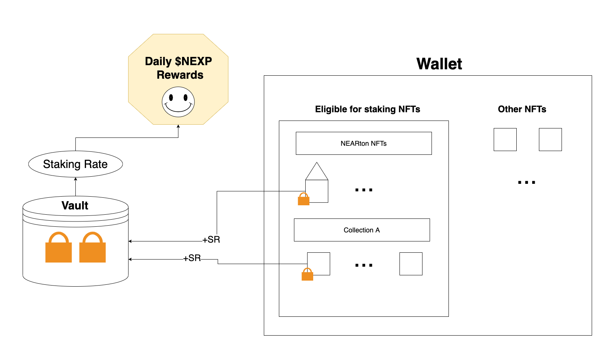

# NFT Staking

You are probably already familiar with the staking concept from DeFi sector or know about the Proof of stake consensus mechanism, but what the heck is __"NFT Staking"__?

Let's dive into that.

## How it works

In short, you stake your NFTs by locking them in the Smart Contract Vault and then receive [$NEXP](./the_NEXP_token.md) rewards according to your Staking Rate.

__Important:__

* We don't control your NFTs. You can unstake them at any time

* Not every NFT will be eligible for staking. Initially, you can stake only NEARton NFTs, but we're going to connect with trusted collections to create the pool. It's up to the community to decide which one should be in the pool.

## The Staking Rate

__The Staking Rate__ is the most interesting and tricky thing because its value is calculated based on your assets.

---

Each home has a base Staking Rate (__bSR__)

__bSR__ calculated based on house district and rarity attributes.

__bSR__ is static. You will know it after the mint.

And if you stake more than one home there are bonus points (__BP__) per each NFT.

---

The NFTs from external collections will also have their own __bSR__ and __BP__.

__NOTE__: __BP__ is needed to encourage people to accumulate assets in one account to get more rewards.

----

To clarify the process, take a look at the picture below.

## Summary

In short, the more NFTs you stake, the more [$NEXP](./the_NEXP_token.md) you get. We give a bonus for staking more than one NFT for the same collection.

Rewards are earned per day (24h cycle) and you can claim them in any time.

